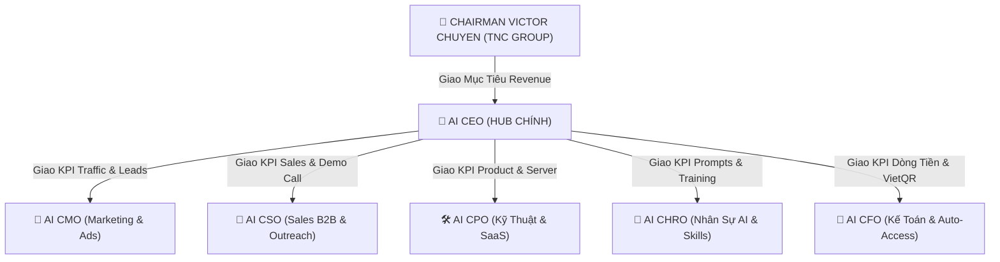

# 👑 BẢNG PHÂN CÔNG KPI & LỆNH ĐIỀU HÀNH TỪ AI CEO OPC-TNC
> **Báo cáo tới**: Chairman Victor Chuyen  
> **Người chỉ huy**: AI CEO (Hub-and-Spoke Orchestrator)  
> **Mục tiêu SPRINT**: **1,000 BIẾT ➔ 100 TẢI ➔ 10 VÀO NHÓM (CK 500K) ➔ 1 KHÁCH CHUYỂN KHOẢN 1M**

---

## 🏛️ SƠ ĐỒ CHỈ HUY MÔ HÌNH HUB-AND-SPOKE

---

## 🎯 BẢNG BÀN GIAO KPI CHI TIẾT TỪNG GIÁM ĐỐC AI (C-SUITE)

### 1. 📢 AI CMO (GIÁM ĐỐC MARKETING & NỘI DUNG)
- **KPI Ngày**: **1,000 Lượt Tiếp Cận (Reach)** ➔ **100 Lượt Tải Mã Nguồn (Gói 0đ)**.
- **Nhiệm vụ cụ thể**:
  1. Quét Meta Ad Library của đối thủ, trích xuất 5 góc nhìn truyền thông (Angles) & viết 5 mẫu Copywriting theo chuẩn Alex Hormozi Grand Slam Offer.
  2. Xuất bản 90 bài Content Matrix lên 3 kênh (Facebook Fanpage, YouTube Shorts, TikTok `@OPCTNC`).
  3. Tối ưu Traffic điều hướng về GitHub `victorChuyen/opc-tnc-one-person-ai-company` & Web App 3D `https://ai.breaths.live`.

---

### 2. 💼 AI CSO (GIÁM ĐỐC BÁN HÀNG B2B)
- **KPI Ngày**: **10 Lead Vào Nhóm CK 500K** ➔ **1 Khách Chốt Gói Setup 1M ($49 USD)**.
- **Nhiệm vụ cụ thể**:
  1. Kích hoạt chuỗi 3-Step Cold Email Outreach tự động qua Resend API gửi cho 100% Leads mới Opt-in.
  2. Duy trì bài ghim Zalo VIP (`https://zalo.me/g/tdhmtu261`) & Discord Global.
  3. Mời khách hàng tiềm năng vào Demo Call 20 phút qua Cal.com (`https://cal.com/victorchuyen/coachai`) & thực thi Kịch bản Demo Script chốt Sales.

---

### 3. 🛠️ AI CPO (GIÁM ĐỐC KỸ THUẬT & SẢN PHẨM)
- **KPI Ngày**: **99.9% Server Uptime** ➔ **Tối ưu trải nghiệm 3D Virtual Office Simulator 360°**.
- **Nhiệm vụ cụ thể**:
  1. Giám sát Web Server REST API `serve_local.mjs` trên cổng 8085 & Telegram Bot Engine (`@OPCTNC_bot`).
  2. Đảm bảo nút bấm chuyển đổi & thanh Footer Bar chứa link `https://coach.io.vn/` hoạt động mượt mà trên cả Mobile & Desktop.

---

### 4. 🧬 AI CHRO (GIÁM ĐỐC NHÂN SỰ & PROMPT VAULT)
- **KPI Ngày**: **Chuẩn hóa 157 Prompt Vault** ➔ **Cập nhật tri thức vận hành Obsidian Vault**.
- **Nhiệm vụ cụ thể**:
  1. Cập nhật tài liệu hướng dẫn nhân bản `BEGINNER_CLONE_GUIDE_AZ.md` & `GITHUB_LEAD_GENERATION_PIPELINE.md`.
  2. Đào tạo Skill & Prompt mới cho 5 Giám đốc AI để nâng cao tỷ lệ phản hồi chính xác 100%.

---

### 5. 🧾 AI CFO (GIÁM ĐỐC TÀI CHÍNH & KẾ TOÁN)
- **KPI Ngày**: **100% Gạch Nợ VietQR & PayPal Tự Động 3 Giây**.
- **Nhiệm vụ cụ thể**:
  1. Kiểm toán Webhook VietQR MB Bank `0989890022` & Cổng PayPal `https://PayPal.Me/victorchuyen`.
  2. Tự động gửi Email cấp quyền Google Drive VIP & thông báo báo cáo Doanh thu MRR tức thì qua Telegram Bot.

---

## 📊 BẢNG BÁO CÁO NHỊP ĐIỆU VẬN HÀNH (DAILY STANDUP ROUTINE)

- ☀️ **08:00 AM**: AI CEO triệu tập 5 Giám Đốc AI họp Standup 5 phút ➔ Phân rã KPI mục tiêu trong ngày.
- 🌆 **12:00 PM**: AI CMO & AI CSO báo cáo số lượng Lead Opt-in & Số cuộc gọi Demo Call.
- 🌙 **21:00 PM**: AI CFO báo cáo tổng doanh thu trong ngày & AI CEO tổng hợp báo cáo gửi Chairman Victor Chuyen!

---
*Lập bởi **AI CEO OPC-TNC** — Dưới sự chỉ đạo trực tiếp của **Chairman Victor Chuyen**.*
