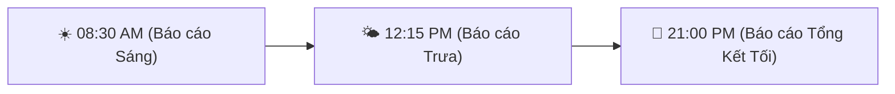

# 📊 BẢNG KPI VẬN HÀNH & LỊCH BÁO CÁO ĐỊNH KỲ (ZERO-FLUFF EXECUTIVE)

---

## 🎯 I. BẢNG KPI BÀI ĐĂNG — GHIM — REPLY TƯƠNG TÁC HÀNG NGÀY

| # | Hạng mục vận hành | KPI Mục tiêu / Ngày | Quy chuẩn thực thi tự động |
|---|------------------|:------------------:|----------------------------|
| 1 | **Đăng bài kèm Media** | **3 Bài / Ngày** | Đính kèm 100% Video MP4 Full HD (`11_Media/Video`) + Banner |
| 2 | **Ghim bài Top (Pin Post)** | **1 Bài ghim cố định** | Ghim bài Offer Gói 0đ & Link Checkout 1M trên Fanpage & Zalo VIP |
| 3 | **Trả lời Comment** | **100% Comments (< 3s)** | Auto-reply comment kèm link `https://ai.breaths.live/checkout` |
| 4 | **Tin nhắn DM / Messenger** | **100% DM (< 5s)** | Auto-DM gửi Media Card Offer + Link Cal.com 1:1 Call |
| 5 | **Tỷ lệ gạch nợ VietQR/PayPal** | **100% Auto (3s)** | Tiền nổ MB Bank `0989890022` ➔ Cấp quyền Drive VIP + Báo Telegram |

---

## ⏰ II. LỊCH BÁO CÁO ĐỊNH KỲ BẮN VỀ TELEGRAM CHO CHAIRMAN (3 LẦN / NGÀY)

1. ☀️ **08:30 AM — BÁO CÁO KHỞI ĐỘNG SÁNG**:
   - Số Leads mới thu về đêm qua
   - Danh sách bài đăng & Video MP4 sẽ xuất bản trong ngày
2. 🌤️ **12:15 PM — BÁO CÁO GIỮA NGÀY**:
   - Số Lượt tương tác / Comments / DM đã trả lời
   - Số cuộc gọi Demo Call đã book trên Cal.com
3. 🌙 **21:00 PM — BÁO CÁO CHỐT DOANH THU & P&L TỐI**:
   - Tổng Doanh Thu Thực Tế (VietQR MB Bank + PayPal)
   - Bảng tổng kết KPI Phễu: `Biết ➔ Tải ➔ Vào Nhóm ➔ CK 1M`

---

## 🛑 III. NGUYÊN TẮC DUYỆT BÀI TỪ CHAIRMAN VICTOR

1. **AI CEO** soạn bài + gán Video MP4 ➔ Trình Chủ tịch danh sách bài.
2. **Chủ tịch ra lệnh `OK`** ➔ Engine kích hoạt đăng tự động + Auto-reply 100%.
3. **Chỉ Push GitHub khi Chủ tịch ra lệnh `UP GITHUB`**.
