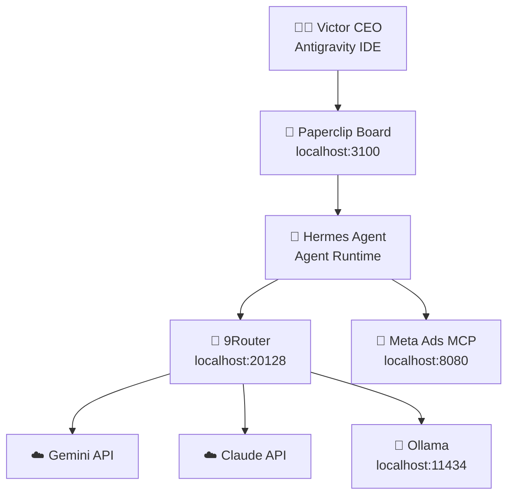

# ⚙️ Tech Stack — OPC TNC

## Kiến Trúc Tổng Thể

## Services & Ports
| Service | Port | Trạng thái | Khởi động |
| :--- | :--- | :--- | :--- |
| Paperclip Board | 3100 | ✅ Active | `pnpm dev` tại `D:\AI_2026\paperclip` |
| 9Router Gateway | 20128 | ✅ Active | `start-9router.bat` tại `D:\All Tool\9router` |
| Ollama | 11434 | ✅ Active | `ollama serve` |
| Meta Ads MCP | 8080 | 🟡 Manual | `npm start` tại `D:\Meta Ads\meta-ads-mcp` |

## Config Files
| File | Đường dẫn | Nội dung |
| :--- | :--- | :--- |
| Paperclip `.env` | `D:\AI_2026\paperclip\.env` | NINEROUTER keys, OLLAMA config |
| MSmile `.env.paperclip` | `D:\AI_2026\MSmile Affiliate\.env.paperclip` | 9Router + Ollama config |
| 9Router config | `D:\All Tool\9router\start-9router.bat` | Port, dashboard pass |

## Liên kết
- [[01-PROJECTS/paperclip]]
- [[01-PROJECTS/9router-gateway]]
- [[01-PROJECTS/hermes-agent]]
- [[01-PROJECTS/meta-ads-mcp]]
