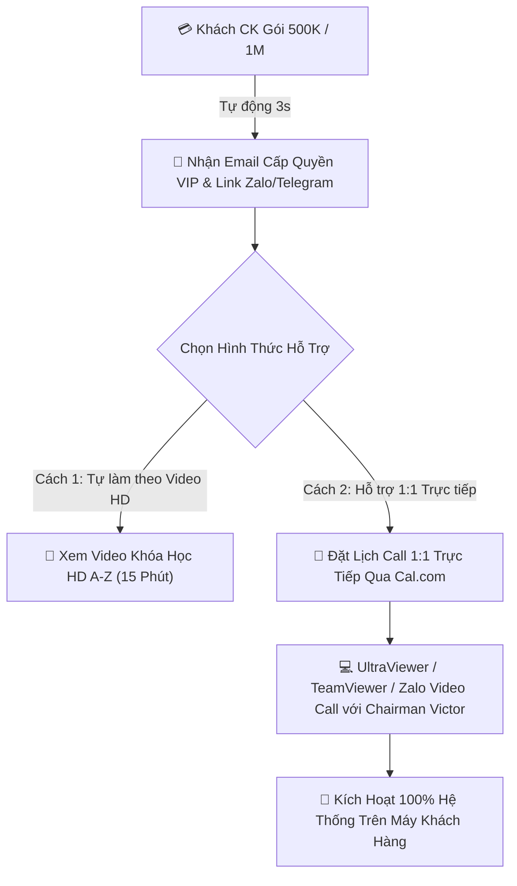

# 🎥 HƯỚNG DẪN CÀI ĐẶT 1-ON-1 QUA ZALO / TELEGRAM & KỊCH BẢN VIDEO KHÓA HỌC HD

> **Dành cho**: Khách hàng đăng ký **Gói VIP 500K** & **Gói Setup 1M**  
> **Kênh hỗ trợ 1-on-1**: 
> - 💬 **Zalo Hotline / Admin**: `0989890022` (Trần Ngọc Chuyền)
> - ✈️ **Telegram Admin**: `@victorchuyen`
> - 📅 **Đặt lịch 1:1 Video Call**: [Cal.com/victorchuyen/coachai](https://cal.com/victorchuyen/coachai)
> - 🎓 **3D Virtual Office Simulator**: [ai.breaths.live](https://ai.breaths.live)

---

## 🎯 I. QUY TRÌNH HỖ TRỢ CÀI ĐẶT 1-ON-1 TRỰC TIẾP (ZALO / TELEGRAM)

Khách hàng sau khi chuyển khoản thành công Gói 500K hoặc Gói 1M sẽ nhận được quy trình hỗ trợ 1-on-1 như sau:



### 📋 Các Bước Đặt Lịch Hỗ Trợ 1-on-1:
1. **Bước 1**: Nhắn tin trực tiếp qua Zalo `0989890022` hoặc Telegram `@victorchuyen` kèm **Mã giao dịch / Email** đã đăng ký.
2. **Bước 2**: Truy cập link [Cal.com/victorchuyen/coachai](https://cal.com/victorchuyen/coachai) để chọn khung giờ 30 - 60 phút phù hợp.
3. **Bước 3**: Chuẩn bị sẵn phần mềm **UltraViewer** hoặc **TeamViewer** trên máy tính.
4. **Bước 4**: Chairman Victor Chuyen sẽ truy cập trực tiếp UltraViewer để cài đặt hoàn chỉnh từ A-Z.

---

## 🎬 II. KỊCH BẢN VIDEO KHÓA HỌC HƯỚNG DẪN CÀI ĐẶT (FULL HD)

*(Dành cho khách hàng muốn tự làm hoặc học chi tiết cấu trúc hệ thống)*

---

### 🟢 **MODUL 1: TẢI MÃ NGUỒN VÀ CHUẨN BỊ MÔI TRƯỜNG (3 PHÚT)**

- 🎙️ **Lời thoại Video**:
  > *"Chào mừng bạn đến với video hướng dẫn cài đặt hệ thống One Person AI Company. Trong 5 phút tới, tôi sẽ hướng dẫn bạn biến chiếc máy tính của mình thành một công ty tự động vận hành bởi 6 Giám đốc AI."*

- 🎬 **Hành động thao tác trên màn hình**:
  1. Truy cập GitHub Repository: [https://github.com/victorChuyen/opc-tnc-one-person-ai-company](https://github.com/victorChuyen/opc-tnc-one-person-ai-company)
  2. Bấm nút green **`Code`** ➔ Chọn **`Download ZIP`** (hoặc `git clone https://github.com/victorChuyen/opc-tnc-one-person-ai-company.git`).
  3. Giải nén thư mục và mở bằng phần mềm **VS Code** (Visual Studio Code).
  4. Cài đặt **Node.js** phiên bản v20+ nếu máy chưa có.

---

### 🟡 **MODULE 2: CẤU HÌNH BIẾN MÔI TRƯỜNG `.ENV` (4 PHÚT)**

- 🎙️ **Lời thoại Video**:
  > *"Bây giờ chúng ta sẽ đấu nối các trái tim tự động hóa: VietQR gạch nợ bank 3s, Telegram Bot thông báo lead realtime, và Resend Email Engine."*

- 🎬 **Hành động thao tác trên màn hình**:
  1. Nhân bản file `.env.template` thành `.env`.
  2. Khai báo các tham số quan trọng:
     ```env
     # VietQR MB Bank
     BANK_NAME=MB Bank
     BANK_ACCOUNT_NAME=Trần Ngọc Chuyền
     BANK_ACCOUNT_NO=0989890022
     VIETQR_BANK_ID=MB
     
     # PayPal Live
     PAYPAL_ME_LINK=https://PayPal.Me/victorchuyen
     
     # Resend Email API Key (Tự động gửi email)
     RESEND_API_KEY=re_your_resend_api_key_here
     RESEND_FROM_EMAIL=🚀 OPC TNC | One Person Company <victor@breaths.live>
     
     # Telegram Bot (@OPCTNC_bot)
     TELEGRAM_BOT_TOKEN=8257466148:AAGjwgPgoGWMknWizOvAmQ_78RaJX60owz8
     TELEGRAM_CHANNEL_ID=-1001812138135
     ```

---

### 🟠 **MODULE 3: KHỞI CHẠY KHÔI PHỤC WEB SERVER LOCAL (3 PHÚT)**

- 🎙️ **Lời thoại Video**:
  > *"Chỉ với 1 dòng lệnh đơn giản, Web Server REST API local của bạn sẽ khởi chạy trên cổng 8085."*

- 🎬 **Hành động thao tác trên màn hình**:
  1. Mở Terminal trong VS Code (`Ctrl + ~`).
  2. Gõ lệnh:
     ```bash
     node serve_local.mjs
     ```
  3. Mở trình duyệt truy cập: `http://localhost:8085` (Giao diện 3D Office Simulator) hoặc `http://localhost:8085/checkout` (Trang thanh toán).

---

### 🔴 **MODULE 4: KÍCH HOẠT 14 TAB GOOGLE SHEETS MASTER SUITE (5 PHÚT)**

- 🎙️ **Lời thoại Video**:
  > *"Cuối cùng, chúng ta sẽ kết nối bảng điều khiển Google Sheet 14 Tabs để theo dõi toàn bộ Leads, Calls, và Doanh thu thực tế."*

- 🎬 **Hành động thao tác trên màn hình**:
  1. Mở file `code.gs` trong thư mục mã nguồn.
  2. Truy cập [script.google.com](https://script.google.com) ➔ Tạo Dự án mới ➔ Dán toàn bộ mã nguồn `code.gs`.
  3. Nhấn **`Run`** hàm `seedFullOptionMasterSuite` để khởi tạo tự động 14 Tabs.
  4. Nhấn **`Deploy`** ➔ Chọn **`New Deployment`** ➔ Chọn **`Web app`** (`Anyone` có quyền truy cập) ➔ Lấy Webhook URL dán vào file `.env`.

---

## 📱 III. MẪU TIN NHẮN TỰ ĐỘNG GỬI CHO KHÁCH HÀNG KHI ĐĂNG KÝ GÓI

### 📩 **Mẫu 1: Tin nhắn Zalo / Telegram gửi ngay sau khi chuyển khoản**:

```text
🎉 CHÀO MỪNG BẠN ĐẾN VỚI HỆ THỐNG OPC-TNC!

Cảm ơn bạn đã đăng ký thành công [Gói VIP 500K / Gói Setup 1M]!

📌 THÔNG TIN KÍCH HOẠT DÀNH CHO BẠN:
1. 📂 Folder Google Drive Mã Nguồn VIP: https://drive.google.com/drive/folders/opc-tnc-vip
2. 💬 Nhóm Zalo Hỗ Trợ VIP: https://zalo.me/g/tdhmtu261
3. ✈️ Nhóm Telegram 2-Way: https://t.me/OPC_TNC

📅 ĐẶT LỊCH HỖ TRỢ 1-ON-1 TRỰC TIẾP VỚI CHAIRMAN VICTOR:
👉 Bạn truy cập link đặt lịch: https://cal.com/victorchuyen/coachai
👉 Chọn ngày & giờ phù hợp để được hỗ trợ qua UltraViewer / Zalo Call.

📞 Hotline hỗ trợ 24/7: 0989890022 (Zalo / Telegram @victorchuyen)
```

---
*Lập bởi **AI CEO OPC-TNC** — Hướng dẫn vận hành hệ thống 1-on-1.*
