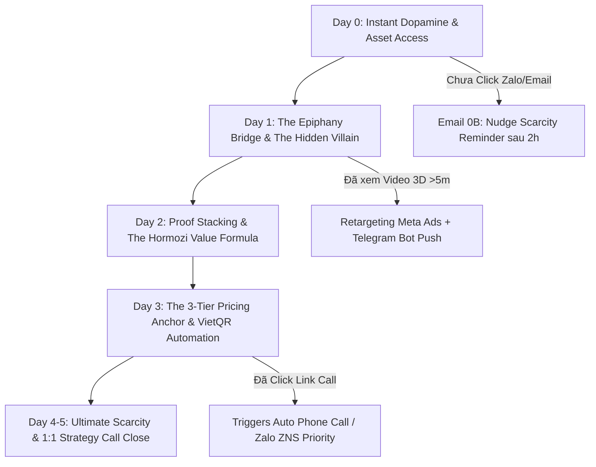

# 🧠 CHIẾN LƯỢC CHI TIẾT: PIPELINE 5-DAY EMAIL CHUYỂN ĐỔI CHUẨN GURU TOP 1 THẾ GIỚI
> **Dành riêng cho**: Chairman Victor Chuyen & Đội ngũ AI Squad OPC-TNC  
> **Khung tư duy hội tụ**: **Alex Hormozi** (Grand Slam Offer) + **Russell Brunson** (Soap Opera & Epiphany Bridge) + **Frank Kern** (Behavioral Dynamic Response) + **Dan Kennedy** (Direct Response Scarcity).

---

## 🎯 I. TRIẾT LÝ VẬN HÀNH PHỄU CHUYỂN ĐỔI BẬC THẦY (CORE PHILOSOPHY)

Hầu hết các chuỗi Email tự động trên thị trường bị thất bại vì **2 lỗi chết người**:
1. **Dạy kiến thức khô khan mà không bán ước mơ (Dramatization Lack)**.
2. **Gửi email dàn trải theo thời gian cứng mà không quan tâm HÀNH VI THẬT của người đọc (Static vs Behavioral)**.

### 💡 4 Trụ Cột Đột Phá Cho Pipeline OPC-TNC:
1. **Dopamine Tức Thì (Instant Gratification)**: 80% chuyển đổi xảy ra trong 15 phút đầu. Ngay sau khi Opt-in, phải tạo được khoảnh khắc **"WOW"** bằng 3D Simulator và quà tặng ngay lập tức.
2. **Cấu trúc Câu Chuyện Nối Tiếp (Soap Opera Sequence)**: Mỗi Email kết thúc bằng một "Vách Đá Cheo Leo" (Cliffhanger) buộc người đọc phải hồi hộp ngóng chờ Email ngày tiếp theo.
3. **Phương Trình Giá Trị Alex Hormozi**:
   $$\text{Giá Trị (Value)} = \frac{\text{Kết Quả Mơ Ước (Dream Outcome)} \times \text{Khả Năng Đạt Được (Likelihood)}}{\text{Thời Gian Chờ (Time Delay)} \times \text{Nỗ Lực & Đánh Đổi (Effort \& Sacrifice)}}$$
   - **Dream Outcome**: Sở hữu Doanh Nghiệp 1 Người cắt giảm 90% chi phí.
   - **Time Delay**: **3 giây** (VietQR Auto Access & Instant Deploy).
   - **Effort & Sacrifice**: **0%** (Đã có sẵn 157 Prompt + 5 AI Directors làm thay).
4. **Tự Động Phân Nhánh Theo Hành Vi (Behavioral Trigger Sync)**: Đồng bộ 3 chiều (Email + Telegram Bot + Zalo ZNS + Google Sheet status).

---

## 📜 II. KỊCH BẢN CHI TIẾT 5 NGÀY (SOAP OPERA SEQUENCE 5-DAY)

---

### 📨 **DAY 0 (NGAY SAU OPT-IN): BÁO ĐỘNG ĐỎ & PHẦN THƯỞNG TỨC THÌ**
- **Tiêu đề**: `[Mã Nguồn OPC] Quyền truy cập 3D AI Company Simulator + Quà tặng của bạn 🎁`
- **Tư duy Guru**: Kích hoạt Dopamine ngay giây đầu tiên. Đưa ra 1 Micro-Commitment (Vào Zalo / Discord) + 1 Offer nhỏ (Tripwire 199k).
- **Cấu trúc**:
  - Cảm ơn & trao quà tức thì (Link Zalo VIP / 157 Prompt).
  - Nhá hàng 3D Simulator 360°.
  - **Cliffhanger**: *"Sáng mai lúc 8:00, tôi sẽ tiết lộ bí mật vì sao 1 doanh nghiệp 20 người lại thua một Solopreneur dùng 5 AI Directors..."*

---

### 📨 **DAY 1 (SAU 24 GIỜ): CÂU CHUYỆN BẤT LỰC & KHOẢNH KHẮC VỠ ỒA (EPIPHANY BRIDGE)**
- **Tiêu đề**: `Bí mật 5 Giám Đốc AI (C-Suite) thay thế đội ngũ 20 nhân sự 🤖`
- **Tư duy Guru**: Russell Brunson Soap Opera — Kể về nỗi đau chảy máu tiền nhân sự, quản lý yếu kém, rồi tìm ra lối thoát Hub-and-Spoke.
- **Cấu trúc**:
  - Kể câu chuyện thật về cuộc khủng hoảng vận hành (Kẻ thù: Lỗi nhân sự & Chi phí cố định cao).
  - Khoảnh khắc bừng sáng: Kiến trúc **Hub-and-Spoke (AI CEO điều phối 5 C-Suite)**.
  - Phân rã vai trò: CMO (Ads/Copy), CSO (Sales B2B), CPO (Dev), CHRO (Prompt), CFO (VietQR).
  - **Cliffhanger**: *"Ngày mai, tôi sẽ cho bạn xem case study thực tế bộ đôi AI CMO & CSO đã mang về 5 lead thật mỗi ngày như thế nào..."*

---

### 📨 **DAY 2 (SAU 48 GIỜ): CHỨNG MINH THỰC TẾ & BẰNG CHỨNG XÁC THỰC (PROOF STACKING)**
- **Tiêu đề**: `Cách AI CMO & CSO tự động săn Lead Meta Ads + B2B Outreach 🎯`
- **Tư duy Guru**: Alex Hormozi Value Equation — Chứng minh Perceived Likelihood of Achievement = 100%.
- **Cấu trúc**:
  - Trưng bày Bằng Chứng Thật (Social Proof):
    - Lead **Lê Văn Phụng** (`097****798`) Opt-in từ Meta Ads.
    - Lead **HOÀNG NGỌC LAN**, **Nguyễn Thiết Hừng** đã kích hoạt hệ thống.
  - Quy trình 3 bước: Scan Ad Library ➔ Draft Ads ➔ Cold Email ➔ VietQR Auto Access.
  - **CTA**: Tải kịch bản Demo Call 20 phút & Neo giá 3 Tier.

---

### 📨 **DAY 3 (SAU 72 GIỜ): BẢNG GIÁ NEO 3 TIER & TỰ ĐỘNG HÓA TÀI CHÍNH 3 GIÂY**
- **Tiêu đề**: `Bảng giá Neo 3 Tier & Kế toán AI CFO gạch nợ VietQR 3 giây 💎`
- **Tư duy Guru**: Dan Kennedy Direct Response — Neo giá để giá cao nhất làm điểm tựa, biến giá trung bình thành một "Kèo Thơm" (No-Brainer Offer).
- **Cấu trúc**:
  - Phân tích tâm lý mua hàng: Vì sao 90% khách chọn gói Tier 2 (Pro Agency).
  - Động cơ AI CFO: Quét MB Bank `0989890022` ➔ Gạch nợ tự động trong 3 giây ➔ Cấp quyền VIP Drive.
  - **CTA**: Trải nghiệm 3D Virtual Office Simulator trực tiếp.

---

### 📨 **DAY 4 & 5 (SAU 96-120 GIỜ): KỶ LUẬT KHAN HIẾM & LỜI MỜI CUỐI CÙNG (THE ULTIMATE SCARCITY)**
- **Tiêu đề**: `[Cơ hội cuối cùng] Sở hữu Bản sao Mã nguồn OPC & Lịch hẹn 1:1 🚀`
- **Tư duy Guru**: Scarcity & Urgency — Không có hạn chót, khách hàng sẽ trì hoãn mãi mãi.
- **Cấu trúc**:
  - Giới hạn cứng: Chỉ còn **3 suất Strategy Call 1:1** duy nhất trong tuần này với Chairman Victor Chuyen.
  - Đánh trúng nỗi sợ bỏ lỡ (FOMO): Giá gói Coaching sẽ tăng lại 2.000.000đ sau 24h.
  - **CTA Mạnh Nhất**: Đặt lịch Cal.com trực tiếp (`https://cal.com/victorchuyen/coachai`).

---

## 🛠️ III. 5 ĐỀ XUẤT NÂNG CẤP KỸ THUẬT ĐỂ CHUYỂN ĐỔI X3 (TECH UPGRADE ROADMAP)

Để đưa Pipeline 5-Day Email lên chuẩn Top 1 Thế Giới, chúng ta cần bổ sung 5 nâng cấp kỹ thuật sau vào hệ thống OPC-TNC:

### 1. ⚡ **Gửi Email Nudge Phụ (Email 0B) Sau 2 Tiếng Tự Động**
- **Cơ chế**: Nếu Lead điền Form mà sau 2 tiếng chưa mở Email 1 hoặc chưa bấm link Zalo/Discord, hệ thống tự động gửi 1 Email nhắc nhở ngắn (Short Curiosity Bump):  
  *Subject: "Bạn gặp sự cố khi tải Mã Nguồn OPC à?"*

### 2. 🎯 **Phân Nhánh Theo Ngành Nghề (Dynamic Content Segmentation)**
- **Cơ chế**: Dựa vào trường `business` (`Agency`, `SME`, `Solopreneur`, `Global English`):
  - Khách `Agency`: Nhấn mạnh vào giảm chi phí nhân sự & nhân bản dự án.
  - Khách `SME`: Nhấn mạnh vào quản trị dòng tiền VietQR & tự động hóa kho bãi.
  - Khách `Global English`: Gửi bằng Tiếng Anh 100%, định hướng Discord Community.

### 3. 📱 **Tích Hợp Zalo ZNS / SMS Brandname Nhắc Lịch Hẹn 1:1**
- **Cơ chế**: Khi Lead đăng ký thành công lịch tư vấn trên `Cal.com`, hệ thống kích hoạt Webhook bắn 1 tin nhắn Zalo ZNS xác nhận lịch hẹn kèm đếm ngược 15 phút trước giờ G.

### 4. 🤖 **AI Agentic Follow-up Trực Tiếp Trên Telegram Bot**
- **Cơ chế**: Mọi hành vi mở Email hoặc Click Link trên Email sẽ được Telegram Bot thông báo riêng cho Chairman Victor (`@victorchuyen`):  
  *`🔥 Lead Lê Văn Phụng vừa click link Cal.com lần 2! Đã sẵn sàng chốt sale!`*

### 5. 📊 **Tracking Tỷ Lệ Mở & Click Thời Gian Thực Trên Google Sheet (Sheet Analytics)**
- **Cơ chế**: Thêm 2 cột vào Tab `Leads` trên Google Sheet:
  - **Cột N**: `Email Opened (Yes/No)`
  - **Cột O**: `Link Clicked (Day 0-5)`
